# Detailed analysis for dataset `ascad_v1_fk_100` ...

## Train and attack results for `original` 

### Number of traces needed for average rank to be zero 

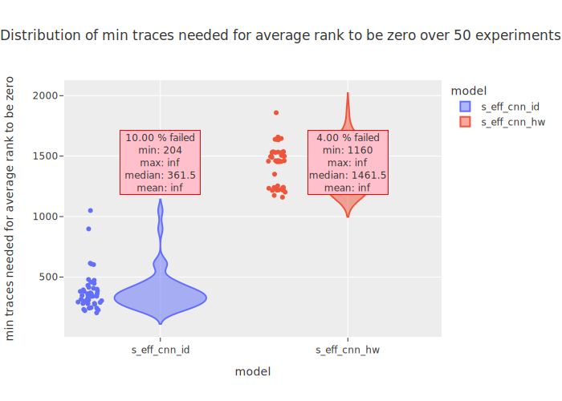

### Average ranks over given number of traces 

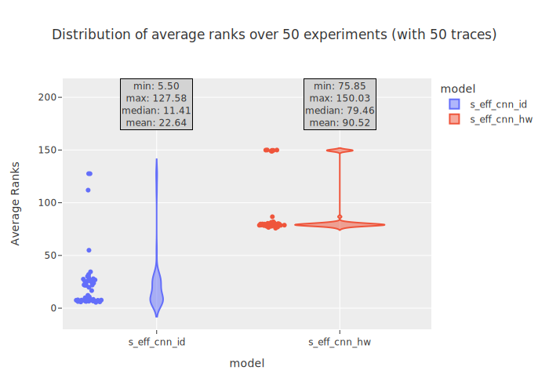
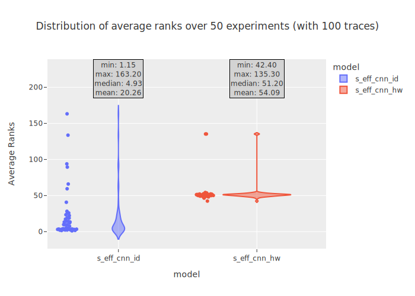
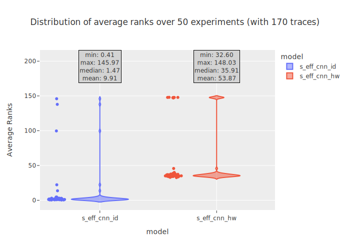
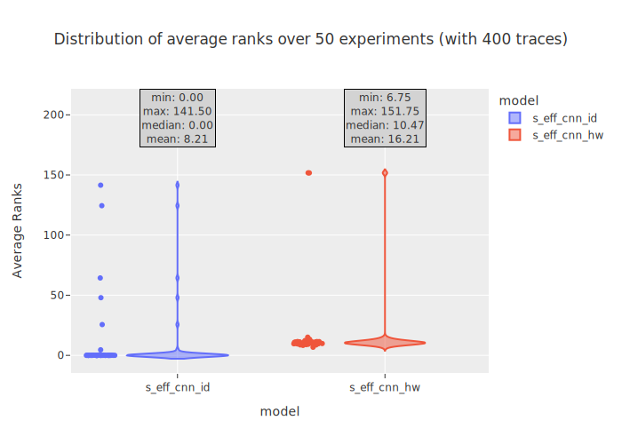
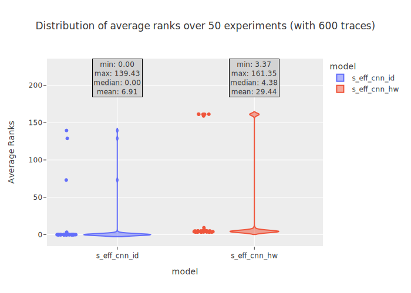
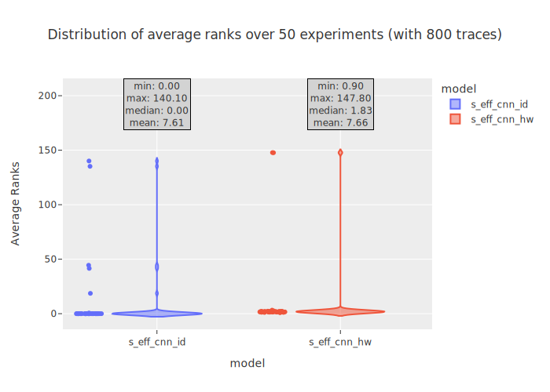

### Average ranks, train/val loss and train/val accuracy 

|s_eff_cnn_id  **6.00 % FAILED** |s_eff_cnn_hw  **16.00 % FAILED** |
|---|---|
|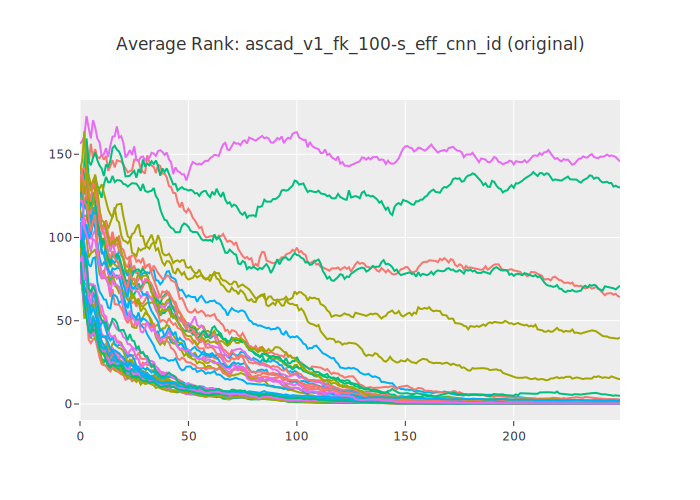|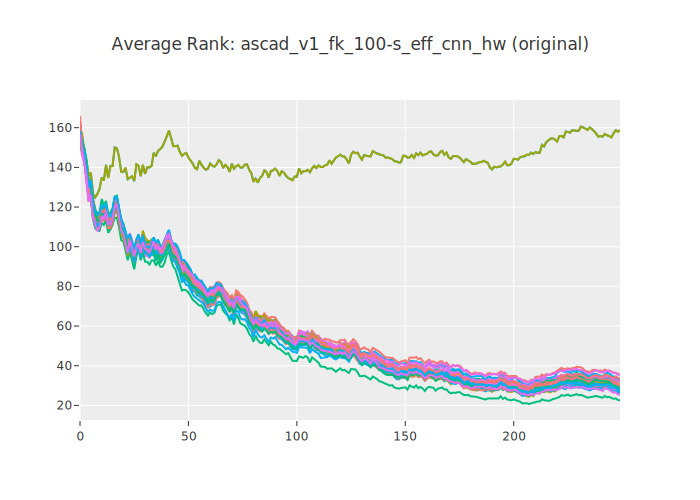|
|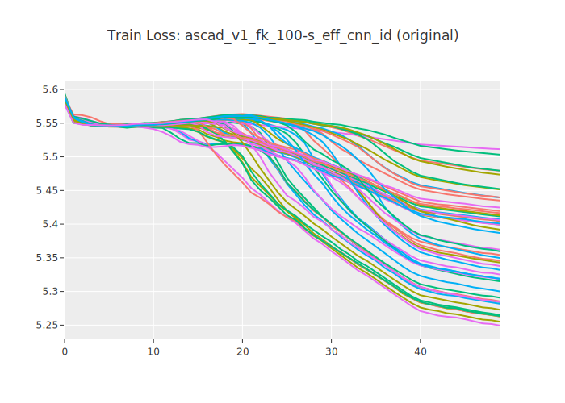|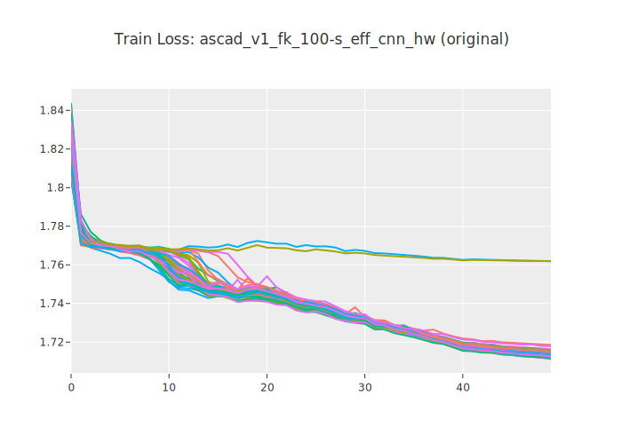|
|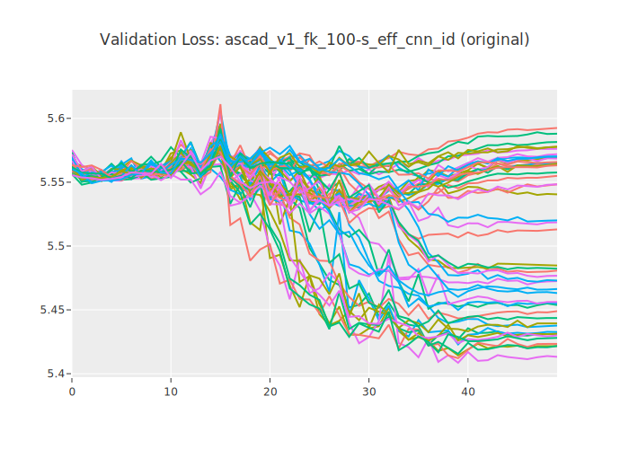|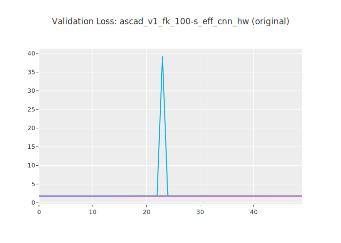|
|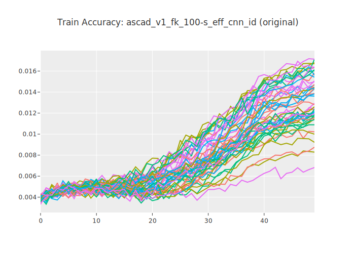|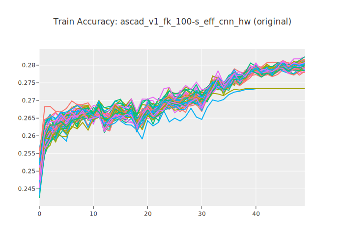|
||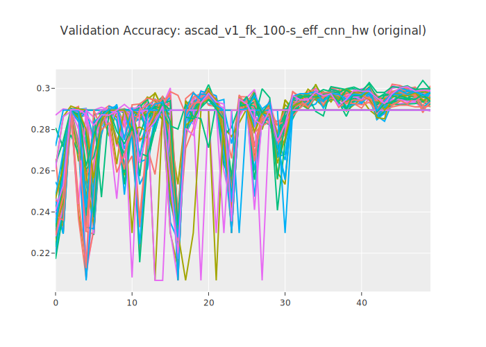|

## Train and attack results for `early_stopping` 

### Number of traces needed for average rank to be zero 

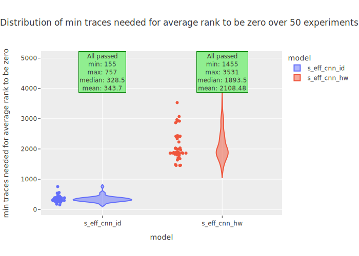

### Average ranks over given number of traces 

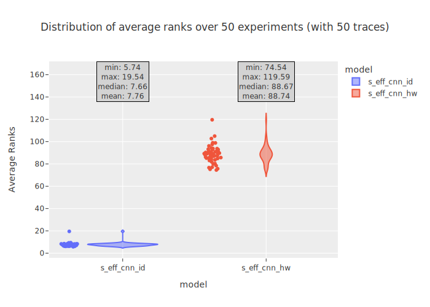
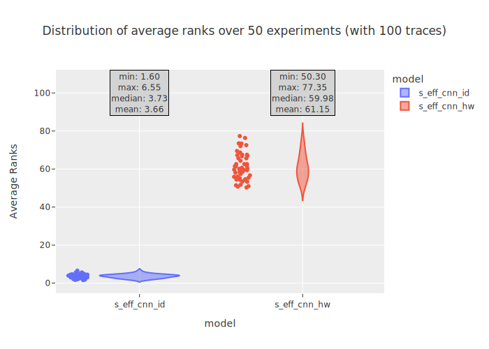

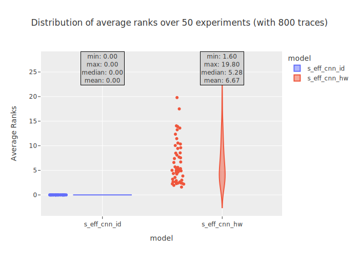

### Average ranks, train/val loss and train/val accuracy 

|s_eff_cnn_id **ALL PASSED** |s_eff_cnn_hw **ALL PASSED** |
|---|---|
|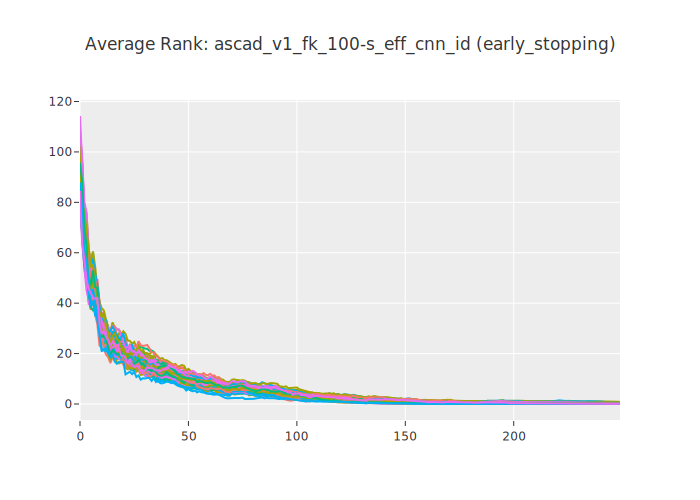|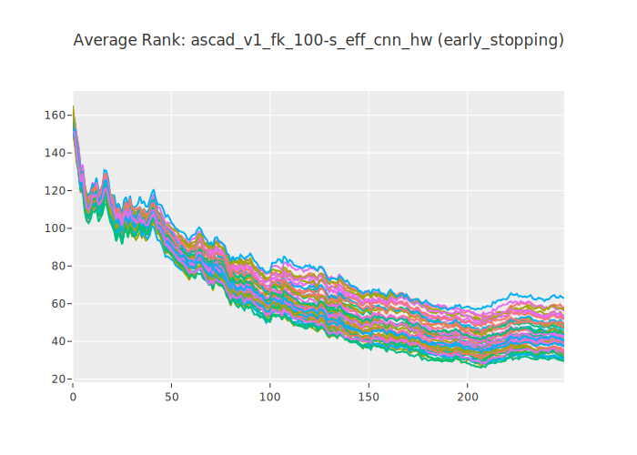|
|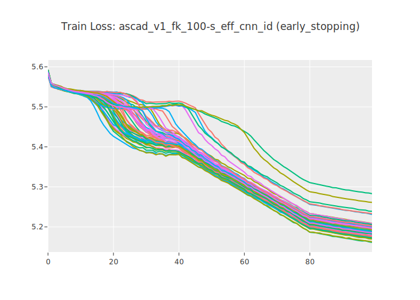|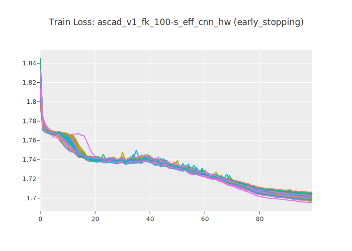|
|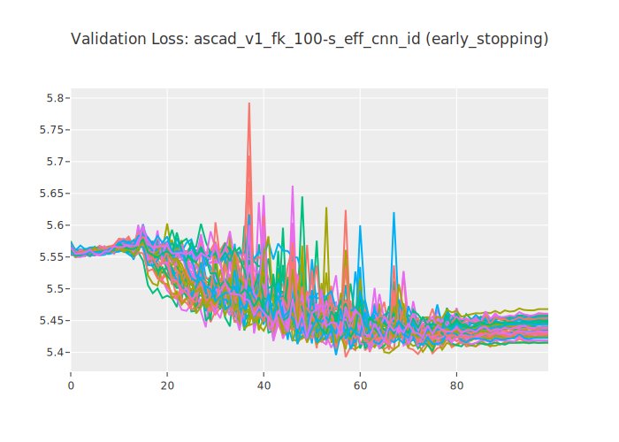||
||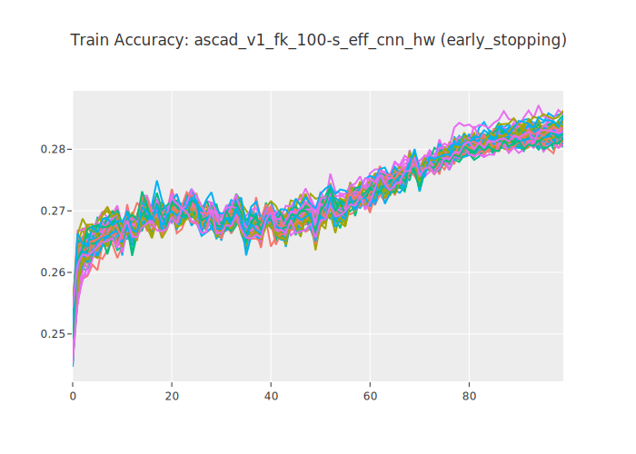|
|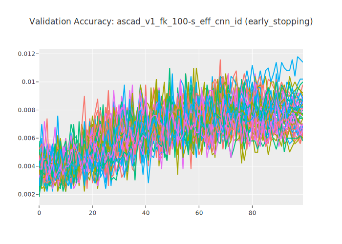|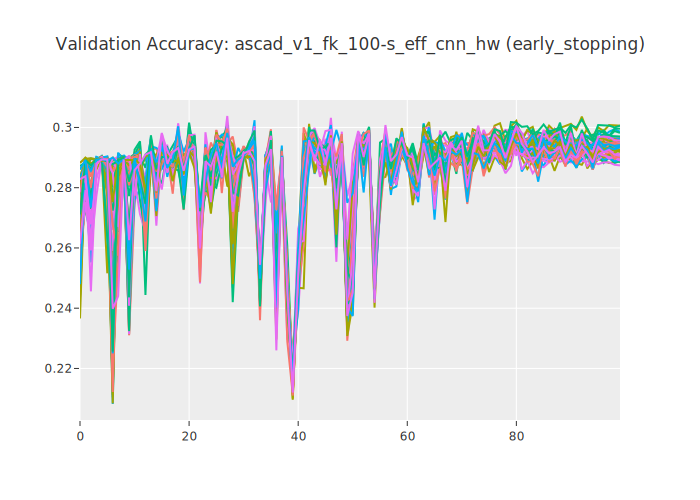|
