# Detailed analysis for dataset `ascad_v1_vk_0_noisy` ...

## Train and attack results for `original` 

### Number of traces needed for average rank to be zero 

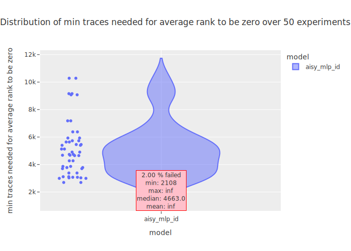

### Average ranks over given number of traces 

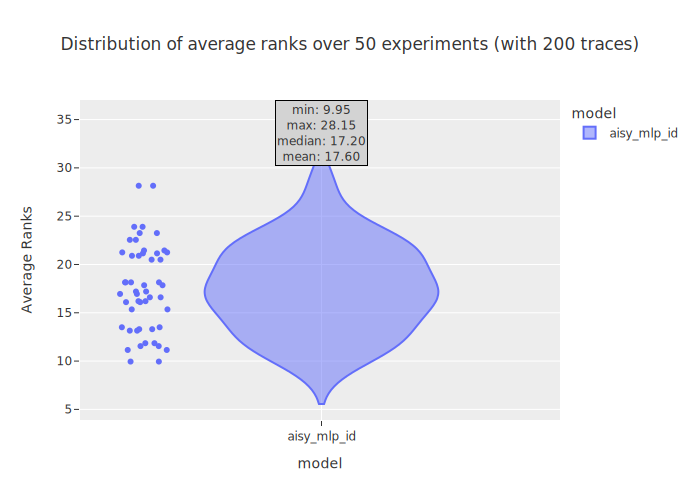

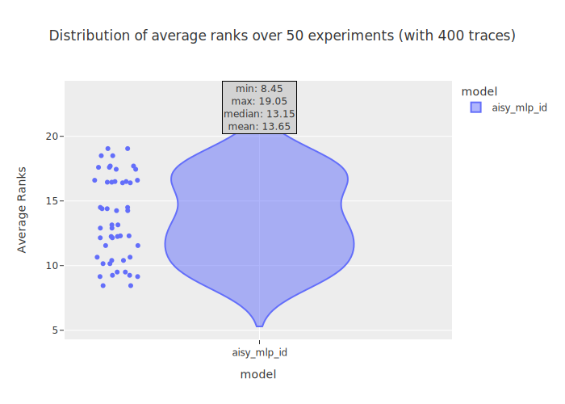
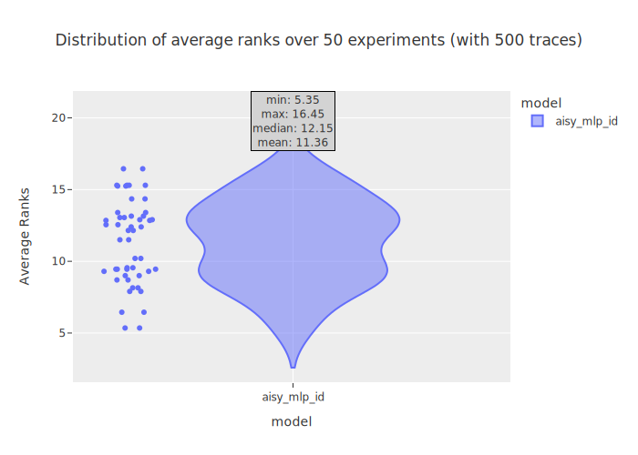
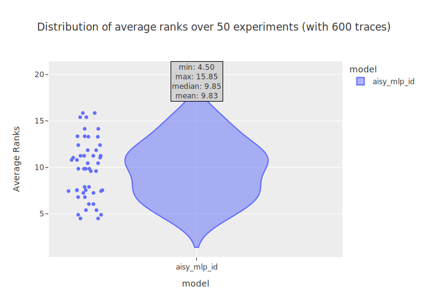
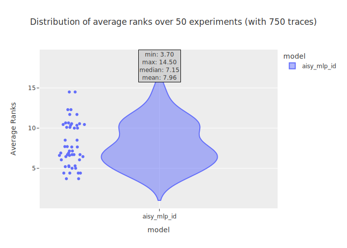

### Average ranks, train/val loss and train/val accuracy 

|aisy_mlp_id  **2.00 % FAILED** |aisy_mlp_hw **ALL PASSED** |
|---|---|
|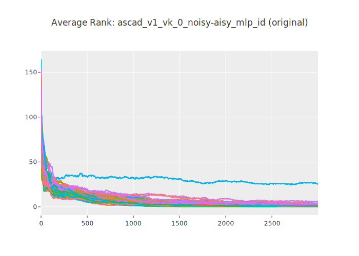||
|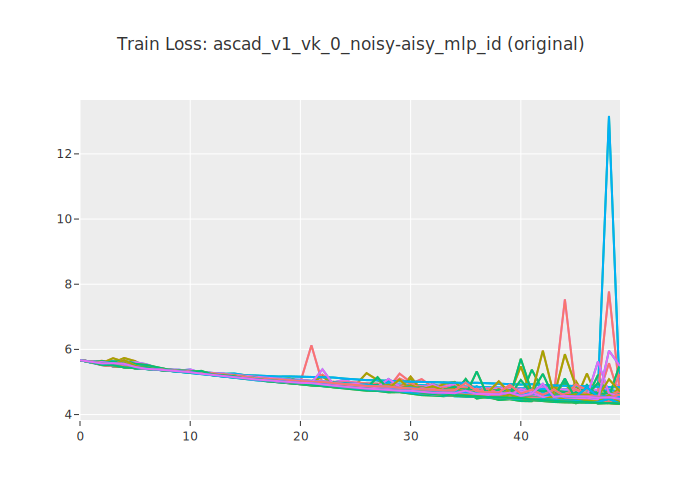|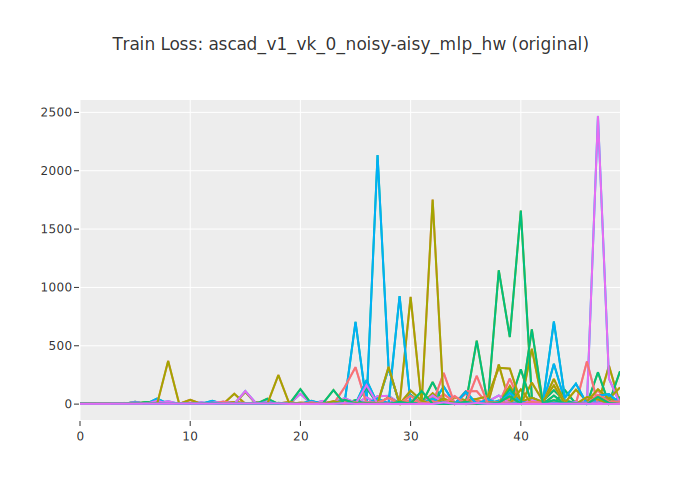|
|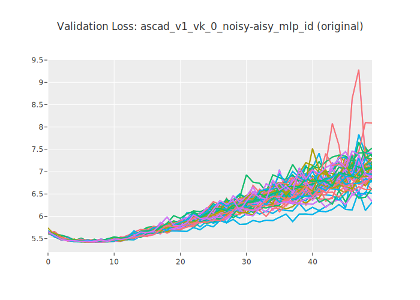|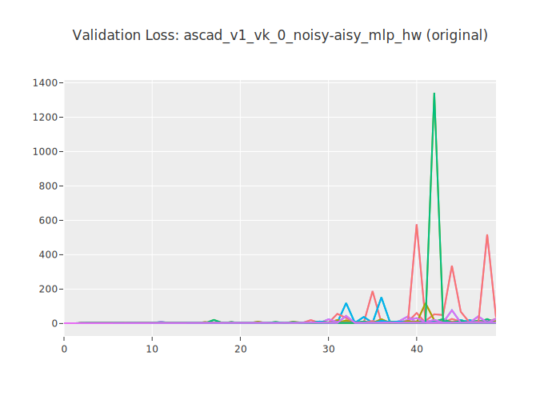|
|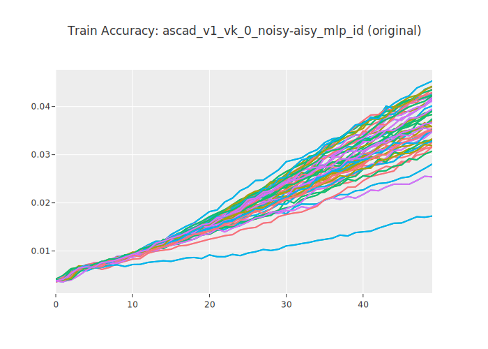||
|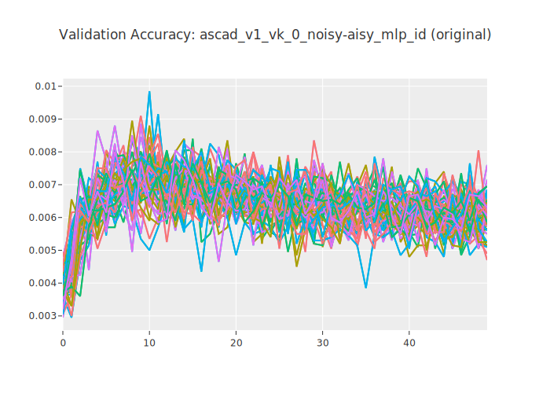|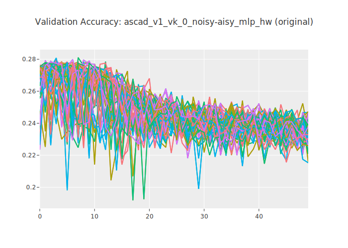|
